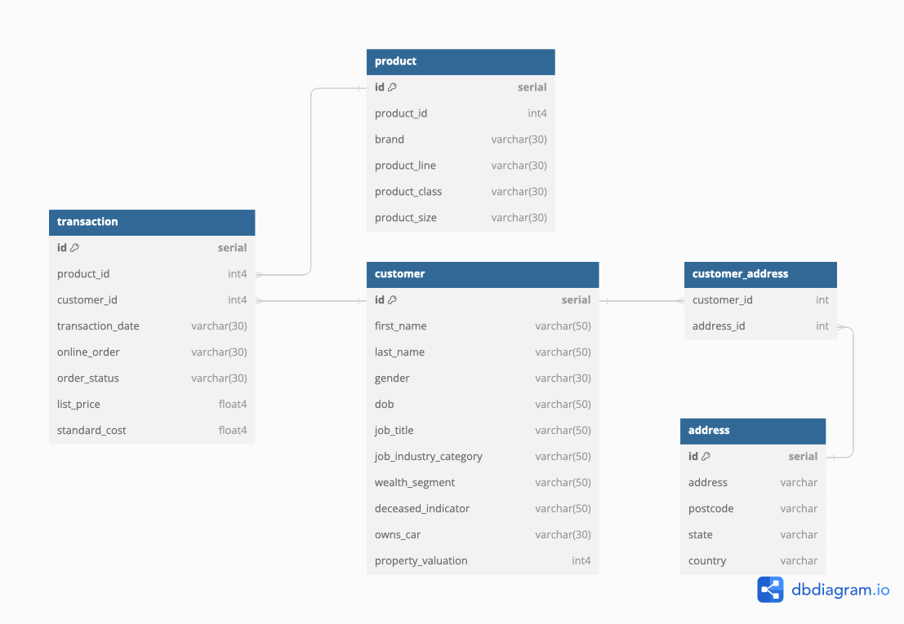

# Создание и нормализация базы данных

## Задание 1. Продумать структуру базы данных и отрисовать в редакторе

Нам дан файл customer_and_transaction.xlsx, содержащий два рабочих листа с данными: transaction и customer.

В таблице transaction содержатся данные о совершенных клиентами транзакциях. Каждая транзакция имеет:

1. уникальный идентификатор транзакции;
2. идентификатор продукта, приобретенного клиентом (сам по себе product_id не позволяет определить уникальность продукта: один и тот же product_id может использоваться для разных продуктов);
3. идентификатор клиента (одна транзакция может быть совершена только одним клиентом), который выступает как внешний ключ, отсылающий к таблице customer;
4. дата транзакции, которая является необходимым атрибутом транзакции;
5. атрибут, показывающий, была ли совершена эта транзакция онлайн;
6. статус заказа (атрибут, имеющий отношение к транзакции);
7. название бренда (атрибут, имеющий отношение к продукту);
8. линейка продукта (атрибут, имеющий отношение к продукту);
9. класс продукта (атрибут, имеющий отношение к продукту);
10. размер продукта (атрибут, имеющий отношение к продукту);
11. прейскурантная цена (атрибут, который должен иметь отношение к продукту, но зависит от даты и для одних и тех же продуктов, т.е. продуктов с одним идентификатором, брендом, линейкой, классом и размером, имеет разную цену, поэтому в целях хранения данных - чтобы не создавать дополнительные уникальные строки в таблице product - этот атрибут может рассматриваться как атрибут транзакции, а не продукта)
12. стандартные затраты, вероятно, на приобретение продукта продавцов (та же ситуация, что и с прейскурантной ценой - атрибут должен иметь отношение к продукту, но в целях хранения данных может рассматриваться как атрибут транзакции, а не продукта).

Таблицу transaction целесообразно разделить на две таблицы: transaction, котораая включает атрибуты, имеющие отношение к транзакции, и product, которая содержит атрибуты, имеющие отноешние к продукту. В качестве идентификатора продукта при объединении таблиц будет использоваться новый уникальный идентификатор продукта. При создани таблицы product также будет создан составной ключ, чтобы в таблице хранились только уникальные сочетания product_id, brand, product_line, product_class и product_size.
Для атрибутов brand, product_line, product_class и product_size можно было бы создать отдельные справочники-таблицы, но это усложнило бы работу с создаваемой базой данных, поэтому мы будем считать дальнейшую декомпозицию нецелесообразной.

В таблице customer содержатся следующие атрибуты:

1. уникальный идентификатор клиента;
2. имя клиента;
3. фамилия клиента;
4. пол клиента;
5. дата рождения клиента;
6. должность клиента;
7. отрасль, в которой работает клиента;
8. категория по степени состоятельности клиента;
9. статус того, жив ли клиент;
10. статус наличия у клиента машины;
11. адрес клиента;
12. индекс клиента;
13. штат проживания клиента;
14. страна проживания клиента.

Все атрибуты этой таблицы имеют отношение к клиенту. Из таблицы customer можно выделить таблицу с адресом, чтобы предусмотреть возможность того, что клиент может иметь несколько адресов (в наших данных это не так, но сама по себе такая ситуация возможна) и таблицу клиент/адрес с двумя внешними ключами (идентификатор клиента и идентификатор адреса), которая связывала бы адреса с клиентами. Недостаток возможной идентификации адреса клиента по почтовому индексу состоит в том, что клиент может иметь два разных адреса с одним индексом (в наших данных это не так, но сама по себе такая ситуация также возможна).
Также возможна, но нецелесообразна с практической точки зрения декомпозиция таблицы с адресом, должностью и отраслью клиента.

База данных будет иметь следующую структуру:

## Задание 2. Нормализовать базу данных (1НФ — 3НФ), описав, к какой нормальной форме приводится таблица и почему таблица в этой нормальной форме изначально не находилась

Таблица transaction находилась во второй нормальной форме: в ней, как было описано выше, содержались атрибуты, зависящие от продукта, а не от собственно самой транзакции. Выделяя таблицу product, мы приводим таблицу transaction к третьей нормальной форме.
Таблица customer находилась во второй нормальной форме: в ней содержались атрибуты, зависящие от адреса (адрес, индекс, штат, страна), которые мы выделили в отдельную таблицу, приведя таблицу transaction к третьей номральной форме.

## Задание 3. Создать все таблицы в DBeaver, указав первичные ключи к таблицам, правильные типы данных, могут ли поля быть пустыми или нет (использовать команду CREATE TABLE)

Скрипт для создания таблиц находится в репозитории: [SmirnovAA_create_table.sql](SmirnovAA_create_table.sql)

Первичный ключ таблицы transaction - id, тип данных serial, по умолчанию не может иметь значение NULL
Первичный ключ таблицы product - id, тип данных serial, по умолчанию не может иметь значение NULL
Первичный ключ таблицы customer - id, тип данных serial, по умолчанию не может иметь значение NULL
Первичный ключ таблицы address - id, тип данных serial, по умолчанию не может иметь значение NULL
В наших таблицах нулевые зна
В таблице product NULL содержится в следующих атрибутах:

- brand (197 строк)
- product_line (197 строк)
- product_class (197 строк)
- product_size (197 строк)

В таблице transaction NULL содержится в следующих атрибутах:

- online_order (360 строк)
- standard_cost (197 строк)

В таблице customer NULL содержится в следующих атрибутах:

- last_name (125 строк)
- dob (87 строк)
- job_title (506 строк)

В таблице address пропуски отстутствуют, но на практике возможны.

## Задание 4. Загрузить данные в таблицы в соответствии с созданной структурой (использовать команду INSERT INTO или загрузить файлы, используя возможности инструмента DBeaver; в случае загрузки файлами приложить скрины, что данные действительно были залиты)

Скрипт для загрузки первых десяти строк исходных таблиц в базу данных находится в репозитории: [SmirnovAA_insert_into.sql](SmirnovAA_insert_into.sql)
