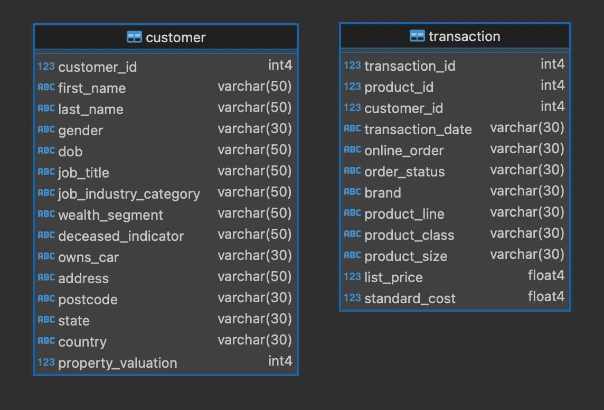

# Основные операторы PostgreSQL

В репозитории доступны два файла:

- [SmirnovAA_HW2.ipynb](SmirnovAA_HW2.ipynb) - Jupyter Notebook с запросами к базе данных с помощью библиотеки psycopg
- [SmirnovAA_HW2.sql](SmirnovAA_HW2.sql)

Запросы выполняются к следующим таблицам customer и transaction:

