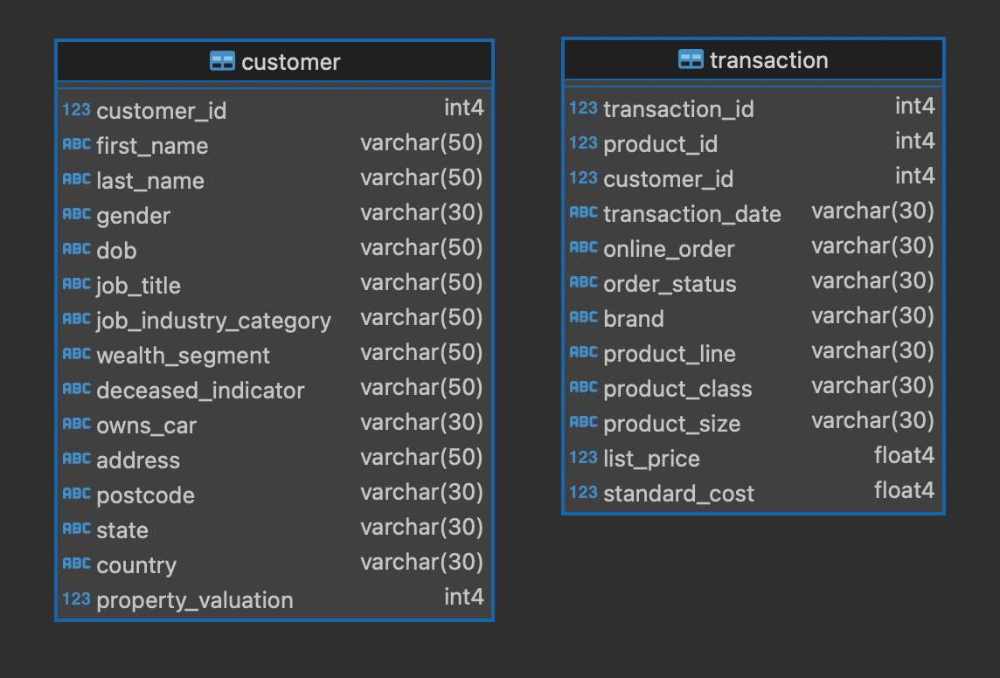

# Группировка данных и оконные функции

В репозитории доступны два файла:

- [SmirnovAA_HW3.ipynb](SmirnovAA_HW3.ipynb) - Jupyter Notebook с запросами к базе данных с помощью библиотеки psycopg
- [SmirnovAA_HW3.sql](SmirnovAA_HW3.sql)

Запросы выполняются к следующим таблицам customer и transaction:

